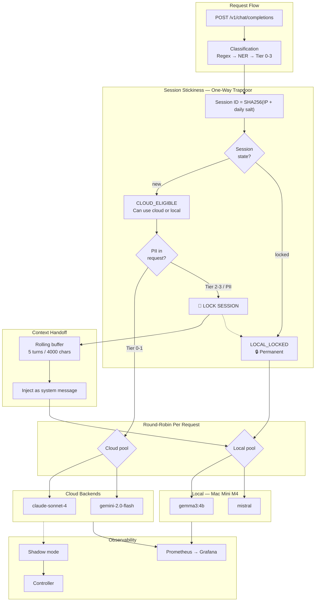
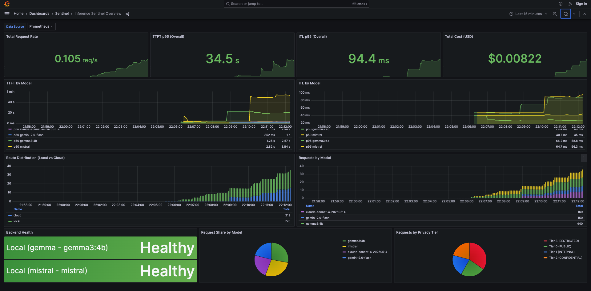
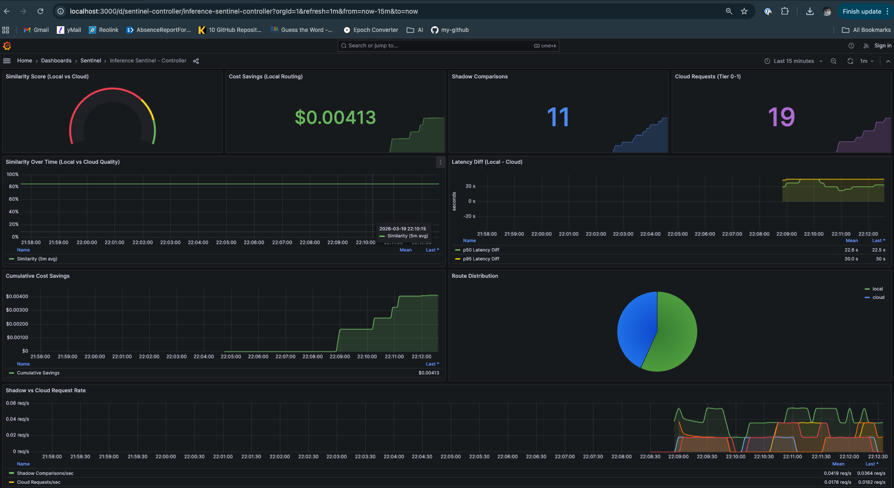

# inference-sentinel

**Privacy-aware LLM routing gateway with production-grade observability**

[](https://github.com/kraghavan/inference-sentinel/actions/workflows/ci.yml)
[](https://www.python.org/downloads/)
[](https://opensource.org/licenses/MIT)

---

## What is this?

inference-sentinel automatically routes LLM prompts to **local** or **cloud** inference based on privacy classification. Sensitive data stays on your hardware; safe queries leverage faster/cheaper cloud providers.

```
┌──────────────────────────────────────────────────────────────────────────────┐
│                           inference-sentinel                                 │
│                                                                              │
│  Request ──▶ [Classification] ──▶ [Privacy Tier] ──▶ [Routing Decision]      │
│                    │                    │                    │               │
│              Regex + NER          0: PUBLIC            Local (Ollama)        │
│              (hybrid)             1: INTERNAL          or                    │
│                                   2: CONFIDENTIAL      Cloud (Claude/Gemini) │
│                                   3: RESTRICTED                              │
│                                         │                                    │
│                                         ▼                                    │
│                              [Shadow Mode A/B]                               │
│                                         │                                    │
│                                         ▼                                    │
│                            [Closed-Loop Controller]                          │
│                                         │                                    │
│                                         ▼                                    │
│                     Prometheus ◀── Metrics ──▶ Grafana                       │
└──────────────────────────────────────────────────────────────────────────────┘
```

## Architecture


## Key Features

| Feature | Description |
|---------|-------------|
| **Privacy Classification** | 4-tier taxonomy (PUBLIC → RESTRICTED) with regex + optional NER |
| **Intelligent Routing** | Route by privacy tier, entity type, or explicit override |
| **Session Stickiness** | PII-triggered session locking with context handoff to local inference |
| **Multi-Backend Support** | Local (Ollama: gemma3:4b + mistral rotation) + Cloud (Anthropic Claude, Google Gemini) |
| **Round-Robin Selection** | Load balance across cloud providers AND local models |
| **Shadow Mode** | A/B compare local vs cloud quality without affecting responses |
| **Closed-Loop Controller** | Observe metrics, recommend routing optimizations |
| **Hot Reload** | Update config without restart via `POST /admin/reload` |
| **Full Observability** | Prometheus metrics, Grafana dashboards, Loki logs, Tempo traces |

---

## Quick Start

### Prerequisites

- Python 3.11+
- [Ollama](https://ollama.ai/) running locally
- Models pulled: `ollama pull gemma3:4b && ollama pull mistral`

### Installation

```bash
git clone https://github.com/kraghavan/inference-sentinel.git
cd inference-sentinel

# Create virtual environment
python -m venv venv
source venv/bin/activate

# Install (choose your extras)
pip install -e ".[dev]"              # Development
pip install -e ".[dev,cloud]"        # + Cloud backends
pip install -e ".[dev,cloud,shadow]" # + Shadow mode (similarity scoring)
pip install -e ".[all]"              # Everything

# Run
uvicorn sentinel.main:app --reload
```

### Test It

```bash
# Health check
curl http://localhost:8000/health

# Send a request (routes based on content)
curl -X POST http://localhost:8000/v1/chat/completions \
  -H "Content-Type: application/json" \
  -d '{
    "messages": [{"role": "user", "content": "What is the capital of France?"}]
  }'

# Check classification
curl -X POST http://localhost:8000/v1/classify \
  -H "Content-Type: application/json" \
  -d '{"text": "My SSN is 123-45-6789"}'
# Returns: {"tier": 3, "tier_label": "RESTRICTED", ...}
```

---

## Privacy Taxonomy

| Tier | Label | Examples | Default Route |
|------|-------|----------|---------------|
| 0 | PUBLIC | General questions, public info | Cloud |
| 1 | INTERNAL | Employee names, internal projects | Cloud (configurable) |
| 2 | CONFIDENTIAL | Email addresses, phone numbers, API keys | Local |
| 3 | RESTRICTED | SSN, credit cards, health records | **Local (forced)** |

Tier 3 content **never** goes to cloud, regardless of configuration.

---

## Docker Deployment (Recommended)

### Hybrid Mode (Recommended for Apple Silicon)

Run Sentinel + observability in Docker, Ollama natively for Metal GPU:

```bash
# Terminal 1: Native Ollama (uses Metal GPU)
ollama serve

# Terminal 2: Docker stack
docker-compose up -d sentinel prometheus grafana loki tempo

# Access points:
# - Sentinel API: http://localhost:8000
# - Grafana:      http://localhost:3000 (admin/sentinel)
# - Prometheus:   http://localhost:9090
```

### Full Docker Mode

```bash
docker-compose up -d
```

---

## Configuration

### Environment Variables

```bash
# Copy example and edit
cp .env.example .env
```

Key settings:

```bash
# Cloud backends (optional - enables cloud routing)
ANTHROPIC_API_KEY=sk-ant-...
GOOGLE_API_KEY=AI...

# Cloud selection strategy
SENTINEL_CLOUD_SELECTION__STRATEGY=round_robin  # or primary_fallback
SENTINEL_CLOUD_SELECTION__PRIMARY=anthropic
SENTINEL_CLOUD_SELECTION__FALLBACK=google

# Shadow mode (A/B comparison)
SENTINEL_SHADOW__ENABLED=true
SENTINEL_SHADOW__SAMPLE_RATE=1.0
SENTINEL_SHADOW__SIMILARITY_ENABLED=true

# Closed-loop controller
SENTINEL_CONTROLLER__ENABLED=true
SENTINEL_CONTROLLER__MODE=observe
SENTINEL_CONTROLLER__EVALUATION_INTERVAL_SECONDS=60

# Session stickiness
SENTINEL_SESSION__ENABLED=true
SENTINEL_SESSION__TTL_SECONDS=900
SENTINEL_SESSION__LOCK_THRESHOLD_TIER=2
SENTINEL_SESSION__BUFFER_SIZE=5
SENTINEL_SESSION__CAPABILITY_GUARDRAIL=true
```

### Routing Configuration

Edit `config/routing.yaml`:

```yaml
cloud:
  selection_strategy: round_robin
  primary: anthropic
  fallback: google

local:
  selection_strategy: round_robin        # Rotate between gemma and mistral
  endpoints:
    - name: mac-mini
      host: localhost
      port: 11434
      model: "gemma3:4b"
      priority: 1
    - name: mac-mini-alt
      host: localhost
      port: 11434
      model: "mistral"
      priority: 1                        # Same priority = round-robin

routing:
  tier_defaults:
    0: { route: cloud }
    1: { route: cloud }
    2: { route: local }
    3: { route: local, override_allowed: false }
  
  force_local_entities:
    - ssn
    - credit_card
    - health_record

shadow:
  enabled: true
  shadow_tiers: [0, 1]
  sample_rate: 1.0

controller:
  enabled: true
  mode: observe
  evaluation_interval_seconds: 60
  window_seconds: 300
  thresholds:
    tier_0: { min_similarity: 0.85, min_samples: 100 }
    tier_1: { min_similarity: 0.80, min_samples: 100 }
```

---

## API Endpoints

### Inference

| Endpoint | Method | Description |
|----------|--------|-------------|
| `/v1/chat/completions` | POST | OpenAI-compatible chat endpoint |
| `/v1/classify` | POST | Classify text for privacy tier |
| `/health` | GET | Health check |
| `/metrics` | GET | Prometheus metrics |

### Admin

| Endpoint | Method | Description |
|----------|--------|-------------|
| `/admin/shadow/metrics` | GET | Shadow mode statistics |
| `/admin/shadow/results` | GET | Recent shadow comparisons |
| `/admin/controller/status` | GET | Controller recommendations |
| `/admin/controller/history` | GET | Recommendation history |
| `/admin/controller/evaluate` | POST | Force controller evaluation |
| `/admin/reload` | POST | Hot-reload config |

---

## Shadow Mode

Shadow mode runs local inference **in parallel** with cloud requests to measure quality parity:

```
Cloud Request (Tier 0/1)
    │
    ├──▶ Cloud Backend ──▶ Response to User
    │
    └──▶ Shadow: Local Backend ──▶ Compare Similarity ──▶ Metrics
```

**Use case**: Prove that local models can replace cloud for certain workloads, saving costs.

```bash
# Enable shadow mode
export SENTINEL_SHADOW__ENABLED=true

# Check results
curl http://localhost:8000/admin/shadow/metrics
```

Response:
```json
{
  "total_shadow_requests": 150,
  "successful_comparisons": 145,
  "average_similarity": 0.89,
  "quality_match_rate": 0.92,
  "total_cost_savings_usd": 12.50
}
```

---

## Session Stickiness

Session stickiness ensures conversational continuity when PII is detected mid-conversation. Once a session encounters sensitive data, it **locks to local inference** for the remainder of the session.

```
Session Start (Cloud)
    │
    ├─▶ Request 1: "Hi, how are you?" → Cloud ✓
    │
    ├─▶ Request 2: "What's 2+2?" → Cloud ✓
    │
    ├─▶ Request 3: "My SSN is 123-45-6789" → Tier 3 detected!
    │                                         │
    │                                         ▼
    │                              SESSION LOCKED TO LOCAL
    │                              + Context buffer handed off
    │
    ├─▶ Request 4: "Thanks!" → Local (locked) 🔒
    │
    └─▶ Request 5: "Bye" → Local (locked) 🔒
```

**Key behaviors:**

| Aspect | Implementation |
|--------|----------------|
| **Session ID** | `SHA256(client_ip + daily_salt)` — rotates every 24h |
| **State Machine** | `CLOUD_ELIGIBLE` → `LOCAL_LOCKED` (one-way, never reverses) |
| **Context Buffer** | Rolling buffer of last 5 turns OR 4000 chars (dual bounding) |
| **Handoff** | Injects buffer as system message with XML tags on state transition |
| **TTL** | 15 min inactivity → session purge |

**Configuration:**

```bash
export SENTINEL_SESSION__ENABLED=true
export SENTINEL_SESSION__TTL_SECONDS=900
export SENTINEL_SESSION__LOCK_THRESHOLD_TIER=2
export SENTINEL_SESSION__BUFFER_SIZE=5
```

**Response headers:**

```
X-Sentinel-Session: abc123...
X-Sentinel-Route: local
X-Sentinel-Backend: ollama
X-Sentinel-Tier: 3
```

---

## Closed-Loop Controller

The controller observes shadow metrics and recommends routing changes:

```bash
curl http://localhost:8000/admin/controller/status
```

Response:
```json
{
  "enabled": true,
  "mode": "observe",
  "running": true,
  "recommendations": [
    {
      "tier": 0,
      "recommendation": "route_to_local",
      "reason": "Similarity 92% exceeds threshold 85% over 500 samples",
      "confidence": "high",
      "potential_savings_usd": 127.50
    }
  ]
}
```

**Modes**:
- `observe`: Log recommendations only (current)
- `auto`: Apply changes automatically (future)

---

## Observability

### Grafana Dashboards

Access at http://localhost:3000 (admin/sentinel):

| Dashboard | Description |
|-----------|-------------|
| **Sentinel Overview** | Request rates, latencies, routing decisions |
| **Sentinel Controller** | Quality metrics, recommendations, drift alerts |

### Key Metrics

| Metric | Description |
|--------|-------------|
| `sentinel_requests_total` | Total requests by tier, route, status |
| `sentinel_classification_latency_seconds` | Classification time |
| `sentinel_inference_latency_seconds` | End-to-end inference time |
| `sentinel_shadow_similarity_score` | Local vs cloud quality |
| `sentinel_shadow_cost_savings_potential_usd` | Potential savings |

---

## Testing

```bash
# Unit tests
pytest tests/unit/ -v

# With coverage
pytest tests/unit/ -v --cov=src/sentinel --cov-report=term-missing

# Specific modules
pytest tests/unit/test_classifier.py -v
pytest tests/unit/test_shadow.py -v
pytest tests/unit/test_controller.py -v
```

---

## Screenshots

### Grafana Overview Dashboard




*Real-time metrics showing routing distribution, backend health, and latency comparison between cloud (Anthropic) and local (Ollama) inference.*

## Grafana Dashboards

### Overview Dashboard (`/d/sentinel-overview`)

| Panel | Description |
|-------|-------------|
| **Total Request Rate** | Requests per second across all backends |
| **TTFT p95 (Overall)** | 95th percentile Time to First Token |
| **ITL p95 (Overall)** | 95th percentile Inter-Token Latency |
| **Total Cost (USD)** | Cumulative cloud inference cost |
| **TTFT by Model** | Time to First Token breakdown: gemma3:4b (🟢), mistral (🟡), claude (🟣), gemini (🔵) |
| **ITL by Model** | Inter-Token Latency by model with p50/p95 percentiles |
| **Route Distribution** | Local vs Cloud request volume over time |
| **Requests by Model** | Request count per model |
| **Backend Health** | Health status of each local endpoint (gemma, mistral) |
| **Request Share by Model** | Pie chart of traffic distribution |
| **Requests by Privacy Tier** | Distribution: Tier 0 (PUBLIC), Tier 1 (INTERNAL), Tier 2 (CONFIDENTIAL), Tier 3 (RESTRICTED) |

### Controller Dashboard (`/d/sentinel-controller`)

| Panel | Description |
|-------|-------------|
| **Similarity Score** | Local vs Cloud quality match (0-100%). Green ≥85%, Yellow ≥70%, Red <70% |
| **Cost Savings** | USD saved by routing to local instead of cloud |
| **Shadow Comparisons** | Number of shadow mode comparisons completed |
| **Cloud Requests (Tier 0-1)** | Requests routed to cloud (low privacy tiers) |
| **Similarity Over Time** | Quality trend with 85% threshold line |
| **Latency Diff** | Local minus Cloud latency. Negative = local faster |
| **Cumulative Cost Savings** | Running total of savings from local routing |
| **Route Distribution** | Pie chart of local vs cloud routing |
| **Shadow vs Cloud Request Rate** | Comparison throughput over time |

### Interpreting the Metrics

- **TTFT (Time to First Token)**: Measures model "thinking time" before streaming begins. Local models typically 500ms-3s, cloud models 100-500ms.
- **ITL (Inter-Token Latency)**: Time between tokens during streaming. Lower = faster output. Target: <50ms.
- **Similarity Score**: Semantic similarity between local and cloud responses. >85% indicates local quality is acceptable.
- **Cost Savings**: Calculated as `cloud_cost - local_cost` for each request. Local inference is $0.

## Project Structure

```
inference-sentinel/
├── src/sentinel/
│   ├── api/                 # FastAPI routes
│   ├── backends/            # Ollama, Anthropic, Google backends
│   ├── classification/      # Regex + NER classifiers
│   ├── controller/          # Closed-loop controller
│   ├── routing/             # Privacy-based routing
│   ├── session/             # Session stickiness (salt, buffer, manager)
│   ├── shadow/              # Shadow mode A/B comparison
│   ├── telemetry/           # Metrics, logging, tracing
│   └── config/              # Settings management
├── config/
│   └── routing.yaml         # Routing configuration
├── tests/
│   ├── unit/                # Unit tests (218 tests)
│   └── integration/         # Integration tests
├── benchmarks/
│   ├── experiments/         # 5 benchmark experiments
│   ├── datasets/            # Synthetic data generator
│   └── harness.py           # Experiment runner
├── observability/
│   ├── grafana/             # Dashboards
│   ├── prometheus/          # Prometheus config
│   ├── loki/                # Log aggregation
│   └── tempo/               # Distributed tracing
├── docker-compose.yml
├── Dockerfile
└── pyproject.toml
```

---

## Roadmap

| Phase | Status | Description |
|-------|--------|-------------|
| 0 - Foundation | ✅ | FastAPI, Ollama backend, Docker Compose |
| 1 - Classification | ✅ | Privacy taxonomy, regex classifier |
| 2 - Routing | ✅ | Tier-based routing, cloud backends |
| 3 - Observability | ✅ | Prometheus, Grafana, Loki, Tempo |
| 4A - Enhanced Classification | ✅ | NER, hybrid classifier, shadow mode, round-robin |
| 4B - Controller | ✅ | Closed-loop controller, hot reload |
| 4C - Session Stickiness | ✅ | PII-triggered session locking, context handoff |
| 5 - Benchmarks | 🔄 | Reproducible experiments (5 experiments implemented) |
| 6 - Production | 🔜 | K8s manifests, security hardening |

---

## Hardware Tested

| Device | Chip | RAM | Models | Role |
|--------|------|-----|--------|------|
| Mac Mini | M4 | 16GB | gemma3:4b, mistral | Primary local inference (rotation) |
| MacBook | M1 | 16GB | mistral | Secondary (failover) |

### Backend Selection Strategy

```
┌─────────────────────────────────────────────────────────────────┐
│                    BACKEND SELECTION                             │
├─────────────────────────────────────────────────────────────────┤
│                                                                  │
│  LOCAL (Tier 2-3):                                               │
│    Mac Mini ──▶ gemma3:4b ◀──┐                                  │
│                              │ Round-Robin                       │
│    Mac Mini ──▶ mistral    ◀─┘                                  │
│                                                                  │
│                                                                  │
│  CLOUD (Tier 0-1):                                               │
│    Anthropic ──▶ claude-sonnet-4 ◀──┐                           │
│                                      │ Round-Robin               │
│    Google    ──▶ gemini-2.0-flash ◀─┘                           │
│                                                                  │
└─────────────────────────────────────────────────────────────────┘
```

**Selection strategies:**
- `round_robin`: Alternate between available backends
- `primary_fallback`: Use primary, failover on error
- `priority`: Use highest-priority healthy backend

---

## License

MIT

---

## Author

[Karthika Raghavan](https://github.com/kraghavan)
