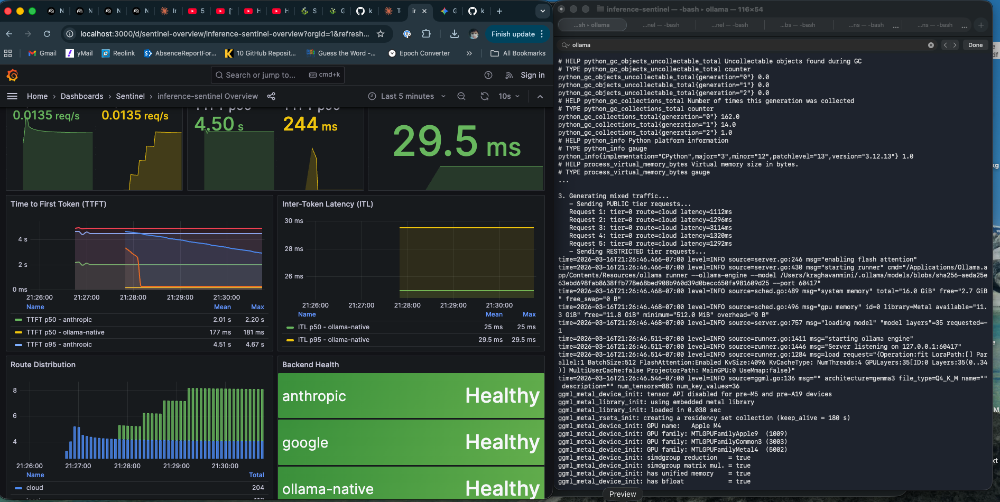

# inference-sentinel

**Privacy-aware LLM routing gateway with production-grade observability**

[](https://github.com/kraghavan/inference-sentinel/actions/workflows/ci.yml)
[](https://www.python.org/downloads/)
[](https://opensource.org/licenses/MIT)

---

## What is this?

inference-sentinel automatically routes LLM prompts to **local** or **cloud** inference based on privacy classification. Sensitive data stays on your hardware; safe queries leverage faster/cheaper cloud providers.

```
┌─────────────────────────────────────────────────────────────────────────────┐
│                           inference-sentinel                                 │
│                                                                              │
│  Request ──▶ [Classification] ──▶ [Privacy Tier] ──▶ [Routing Decision]    │
│                    │                    │                    │               │
│              Regex + NER          0: PUBLIC            Local (Ollama)       │
│              (hybrid)             1: INTERNAL          or                    │
│                                   2: CONFIDENTIAL      Cloud (Claude/Gemini)│
│                                   3: RESTRICTED                              │
│                                         │                                    │
│                                         ▼                                    │
│                              [Shadow Mode A/B]                               │
│                                         │                                    │
│                                         ▼                                    │
│                            [Closed-Loop Controller]                          │
│                                         │                                    │
│                                         ▼                                    │
│                     Prometheus ◀── Metrics ──▶ Grafana                      │
└─────────────────────────────────────────────────────────────────────────────┘
```

## Key Features

| Feature | Description |
|---------|-------------|
| **Privacy Classification** | 4-tier taxonomy (PUBLIC → RESTRICTED) with regex + optional NER |
| **Intelligent Routing** | Route by privacy tier, entity type, or explicit override |
| **Multi-Backend Support** | Local (Ollama) + Cloud (Anthropic Claude, Google Gemini) |
| **Round-Robin Cloud Selection** | Load balance across cloud providers |
| **Shadow Mode** | A/B compare local vs cloud quality without affecting responses |
| **Closed-Loop Controller** | Observe metrics, recommend routing optimizations |
| **Hot Reload** | Update config without restart via `POST /admin/reload` |
| **Full Observability** | Prometheus metrics, Grafana dashboards, Loki logs, Tempo traces |

---

## Quick Start

### Prerequisites

- Python 3.11+
- [Ollama](https://ollama.ai/) running locally
- A model pulled: `ollama pull gemma3:4b`

### Installation

```bash
git clone https://github.com/kraghavan/inference-sentinel.git
cd inference-sentinel

# Create virtual environment
python -m venv venv
source venv/bin/activate

# Install (choose your extras)
pip install -e ".[dev]"              # Development
pip install -e ".[dev,cloud]"        # + Cloud backends
pip install -e ".[dev,cloud,shadow]" # + Shadow mode (similarity scoring)
pip install -e ".[all]"              # Everything

# Run
uvicorn sentinel.main:app --reload
```

### Test It

```bash
# Health check
curl http://localhost:8000/health

# Send a request (routes based on content)
curl -X POST http://localhost:8000/v1/chat/completions \
  -H "Content-Type: application/json" \
  -d '{
    "messages": [{"role": "user", "content": "What is the capital of France?"}]
  }'

# Check classification
curl -X POST http://localhost:8000/v1/classify \
  -H "Content-Type: application/json" \
  -d '{"text": "My SSN is 123-45-6789"}'
# Returns: {"tier": 3, "tier_label": "RESTRICTED", ...}
```

---

## Privacy Taxonomy

| Tier | Label | Examples | Default Route |
|------|-------|----------|---------------|
| 0 | PUBLIC | General questions, public info | Cloud |
| 1 | INTERNAL | Employee names, internal projects | Cloud (configurable) |
| 2 | CONFIDENTIAL | Email addresses, phone numbers, API keys | Local |
| 3 | RESTRICTED | SSN, credit cards, health records | **Local (forced)** |

Tier 3 content **never** goes to cloud, regardless of configuration.

---

## Docker Deployment (Recommended)

### Hybrid Mode (Recommended for Apple Silicon)

Run Sentinel + observability in Docker, Ollama natively for Metal GPU:

```bash
# Terminal 1: Native Ollama (uses Metal GPU)
ollama serve

# Terminal 2: Docker stack
docker-compose up -d sentinel prometheus grafana loki tempo

# Access points:
# - Sentinel API: http://localhost:8000
# - Grafana:      http://localhost:3000 (admin/sentinel)
# - Prometheus:   http://localhost:9090
```

### Full Docker Mode

```bash
docker-compose up -d
```

---

## Configuration

### Environment Variables

```bash
# Copy example and edit
cp .env.example .env
```

Key settings:

```bash
# Cloud backends (optional - enables cloud routing)
ANTHROPIC_API_KEY=sk-ant-...
GOOGLE_API_KEY=AI...

# Cloud selection strategy
SENTINEL_CLOUD_SELECTION__STRATEGY=round_robin  # or primary_fallback
SENTINEL_CLOUD_SELECTION__PRIMARY=anthropic
SENTINEL_CLOUD_SELECTION__FALLBACK=google

# Shadow mode (A/B comparison)
SENTINEL_SHADOW__ENABLED=true
SENTINEL_SHADOW__SAMPLE_RATE=1.0
SENTINEL_SHADOW__SIMILARITY_ENABLED=true

# Closed-loop controller
SENTINEL_CONTROLLER__ENABLED=true
SENTINEL_CONTROLLER__MODE=observe
SENTINEL_CONTROLLER__EVALUATION_INTERVAL_SECONDS=60
```

### Routing Configuration

Edit `config/routing.yaml`:

```yaml
cloud:
  selection_strategy: round_robin
  primary: anthropic
  fallback: google

routing:
  tier_defaults:
    0: { route: cloud }
    1: { route: cloud }
    2: { route: local }
    3: { route: local, override_allowed: false }
  
  force_local_entities:
    - ssn
    - credit_card
    - health_record

shadow:
  enabled: true
  shadow_tiers: [0, 1]
  sample_rate: 1.0

controller:
  enabled: true
  mode: observe
  evaluation_interval_seconds: 60
  window_seconds: 300
  thresholds:
    tier_0: { min_similarity: 0.85, min_samples: 100 }
    tier_1: { min_similarity: 0.80, min_samples: 100 }
```

---

## API Endpoints

### Inference

| Endpoint | Method | Description |
|----------|--------|-------------|
| `/v1/chat/completions` | POST | OpenAI-compatible chat endpoint |
| `/v1/classify` | POST | Classify text for privacy tier |
| `/health` | GET | Health check |
| `/metrics` | GET | Prometheus metrics |

### Admin

| Endpoint | Method | Description |
|----------|--------|-------------|
| `/admin/shadow/metrics` | GET | Shadow mode statistics |
| `/admin/shadow/results` | GET | Recent shadow comparisons |
| `/admin/controller/status` | GET | Controller recommendations |
| `/admin/controller/history` | GET | Recommendation history |
| `/admin/controller/evaluate` | POST | Force controller evaluation |
| `/admin/reload` | POST | Hot-reload config |

---

## Shadow Mode

Shadow mode runs local inference **in parallel** with cloud requests to measure quality parity:

```
Cloud Request (Tier 0/1)
    │
    ├──▶ Cloud Backend ──▶ Response to User
    │
    └──▶ Shadow: Local Backend ──▶ Compare Similarity ──▶ Metrics
```

**Use case**: Prove that local models can replace cloud for certain workloads, saving costs.

```bash
# Enable shadow mode
export SENTINEL_SHADOW__ENABLED=true

# Check results
curl http://localhost:8000/admin/shadow/metrics
```

Response:
```json
{
  "total_shadow_requests": 150,
  "successful_comparisons": 145,
  "average_similarity": 0.89,
  "quality_match_rate": 0.92,
  "total_cost_savings_usd": 12.50
}
```

---

## Closed-Loop Controller

The controller observes shadow metrics and recommends routing changes:

```bash
curl http://localhost:8000/admin/controller/status
```

Response:
```json
{
  "enabled": true,
  "mode": "observe",
  "running": true,
  "recommendations": [
    {
      "tier": 0,
      "recommendation": "route_to_local",
      "reason": "Similarity 92% exceeds threshold 85% over 500 samples",
      "confidence": "high",
      "potential_savings_usd": 127.50
    }
  ]
}
```

**Modes**:
- `observe`: Log recommendations only (current)
- `auto`: Apply changes automatically (future)

---

## Observability

### Grafana Dashboards

Access at http://localhost:3000 (admin/sentinel):

| Dashboard | Description |
|-----------|-------------|
| **Sentinel Overview** | Request rates, latencies, routing decisions |
| **Sentinel Controller** | Quality metrics, recommendations, drift alerts |

### Key Metrics

| Metric | Description |
|--------|-------------|
| `sentinel_requests_total` | Total requests by tier, route, status |
| `sentinel_classification_latency_seconds` | Classification time |
| `sentinel_inference_latency_seconds` | End-to-end inference time |
| `sentinel_shadow_similarity_score` | Local vs cloud quality |
| `sentinel_shadow_cost_savings_potential_usd` | Potential savings |

---

## Testing

```bash
# Unit tests
pytest tests/unit/ -v

# With coverage
pytest tests/unit/ -v --cov=src/sentinel --cov-report=term-missing

# Specific modules
pytest tests/unit/test_classifier.py -v
pytest tests/unit/test_shadow.py -v
pytest tests/unit/test_controller.py -v
```

---

## Screenshots

### Grafana Overview Dashboard



*Real-time metrics showing routing distribution, backend health, and latency comparison between cloud (Anthropic) and local (Ollama) inference.*

## Project Structure

```
inference-sentinel/
├── src/sentinel/
│   ├── api/                 # FastAPI routes
│   ├── backends/            # Ollama, Anthropic, Google backends
│   ├── classification/      # Regex + NER classifiers
│   ├── controller/          # Closed-loop controller
│   ├── routing/             # Privacy-based routing
│   ├── shadow/              # Shadow mode A/B comparison
│   ├── telemetry/           # Metrics, logging, tracing
│   └── config/              # Settings management
├── config/
│   └── routing.yaml         # Routing configuration
├── tests/
│   ├── unit/                # Unit tests
│   └── integration/         # Integration tests
├── observability/
│   ├── grafana/             # Dashboards
│   ├── prometheus/          # Prometheus config
│   ├── loki/                # Log aggregation
│   └── tempo/               # Distributed tracing
├── docker-compose.yml
├── Dockerfile
└── pyproject.toml
```

---

## Roadmap

| Phase | Status | Description |
|-------|--------|-------------|
| 0 - Foundation | ✅ | FastAPI, Ollama backend, Docker Compose |
| 1 - Classification | ✅ | Privacy taxonomy, regex classifier |
| 2 - Routing | ✅ | Tier-based routing, cloud backends |
| 3 - Observability | ✅ | Prometheus, Grafana, Loki, Tempo |
| 4A - Enhanced Classification | ✅ | NER, hybrid classifier, shadow mode, round-robin |
| 4B - Controller | ✅ | Closed-loop controller, hot reload |
| 5 - Benchmarks | 🔜 | Reproducible experiments |
| 6 - Production | 🔜 | K8s manifests, security hardening |

---

## Hardware Tested

| Device | Chip | RAM | Model | Role |
|--------|------|-----|-------|------|
| Mac Mini | M4 | 16GB | gemma3:4b | Primary local inference |
| MacBook | M1 | 16GB | gemma2:9b | Secondary (failover) |

---

## License

MIT

---

## Author

[Karthika Raghavan](https://github.com/kraghavan)
